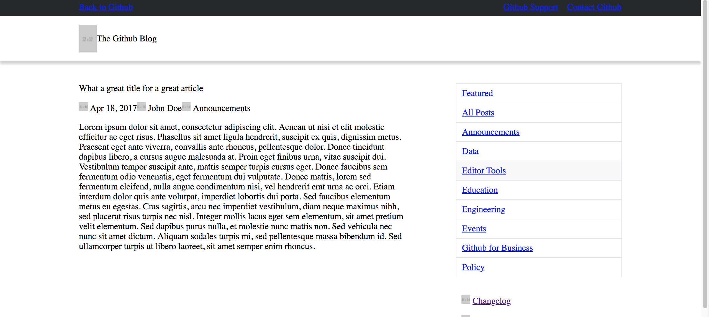

# From mockup to code

Here follows a checklist-guide to follow when you wish to build a web-page from a static design images.

## Overview / Checklist

**Page Layout**

- [ ] [Identify Boxes and sub-boxes](#identify-boxes-and-sub-boxes)
- [ ] [Position Boxes / Use Grid system](#position-boxes)
- [ ] [Put (placeholder) content ](#put-content)

Repeat the above steps progressively per 'level'... from outer boxes to inner boxes. (See example below).

**Box Layout**

- [ ] [Use a CSS normalizer](#use-a-css-normalizer)
- [ ] [Identify margins & paddings](#identify-paddings-and-margins)
- [ ] [Identify box styles](#identify-box-styles)
  - [ ] background color/style
  - [ ] border color/style
- [ ] [Identify content text styles](#identify-text-styles)
  - [ ] Font family, weight, color, style, etc...
  - [ ] Text positioning, overflow, etc...

## Detailed Steps

Here follow more detailed description / demo of each step:

### Identify Boxes and sub-boxes

Break down your page into boxes and sub-boxes, and other boxes contained in boxes, etc...

Example: _[https://blog.github.com/2014-04-28-task-lists-in-all-markdown-documents/](https://blog.github.com/2014-04-28-task-lists-in-all-markdown-documents/)_

### Position Boxes

First create the basic layout and use a grid system for the main areas. Like the following:

Then continue to break down each box into newer boxes and position them relative to each other.

Repeat the process until you reach at a point where you consider that boxes-layout is the one you want.

etc...

**Tips**

Use a grid system, even a very simple one. See my other project: [A minimum grid system](https://github.com/killerchip/html5-cheatsheet/tree/simple-grid-framework)

Also use a separate `layout-demo.css` to apply those peculiar background and border coloring, while you are building out your layout. Once you're done, you can remove this 'funny' coloring scheme by removing a single line from your html page.

You can use an automatic placeholder image generator like [placeholder.com](https://placeholder.com/) to easily create placeholder images of the size you want.

### Put content

You may start puttnig content in your page. Either placeholder content or normal content if you have it.
Don't worry about the content style, or if the elements are semantically correct. You will edit them later.
We are still in the process of laying-out our layout :-)

Example:

And finally, any 'boxes' that are not part of the grid, but still have to 'stack' one besides the other, can be 'aligned' now. But don't go into extra effort into setting up margins and padding for now.

For example see below the top-right nav menu, and the menu below the article title...

### Use a CSS normalizer

Use a reset CSS stylesheet so you have the same behavior on all browsers.
An proposal would be:

[https://necolas.github.io/normalize.css/ ](https://necolas.github.io/normalize.css/)

That is, if your chosen CSS framework does not contain something already

### Identify Paddings and Margins

Using the digital mockup calculate the margins and paddings and apply them to your boxes.
Don't worry for now for the content styling.

### Identify box styles

Identify and render box styling. This includes background colors, border colors, box-shadows etc.

### Identify text styles

Identify and render text styles, colors, etc.

Icons where rendered with: [https://fontawesome.com/](https://fontawesome.com/)

Fonts from: [Google Fonts](https://fonts.google.com/)

