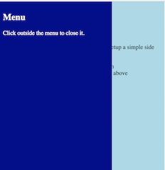

# Simple Side Menu

This is an example of how to create a side menu, without using any framework but pure HTML/CSS/JS




In our page we define a `nav` section which will be our menu.

```
<body>

    <nav class="menu">
        <h2>Menu</h2>
        <p>Click outside the menu to close it.</p>
    </nav>

    <main class="page-content">
        <!-- Page content goes here -->
    </main>
</body>
```

In CSS we initially set the main page content height to 100%:
```
html,
body,
main {  
  /* We put "main" as 100% so
   * when the user clicks anywhere
   * on the page, the menu closes
   */
  height: 100%;
}
```

We also do the same for the menu
```
nav {
  background-color: darkblue;
  color: white;
  padding: 0.5em;

  height: 100%;
  width: 300px;
  margin: 0;
}
```

Then we position the menu in its normal position and hide it (initially)
```
nav {
  /* We set the side menu normal position initially */
  position: absolute;
  left: 0;
  top: 0;

  /* Here we hide the side menu by positioning it off canvas */
  -webkit-transform: translate(-308px, 0);
  transform: translate(-300px, 0);
  transition: transform 0.3s ease;
}
```

Then by assigning the class `open` to the nav menu we bring it into display
```
nav.open {
  -webkit-transform: translate(0, 0);
  transform: translate(0, 0);
}
```

